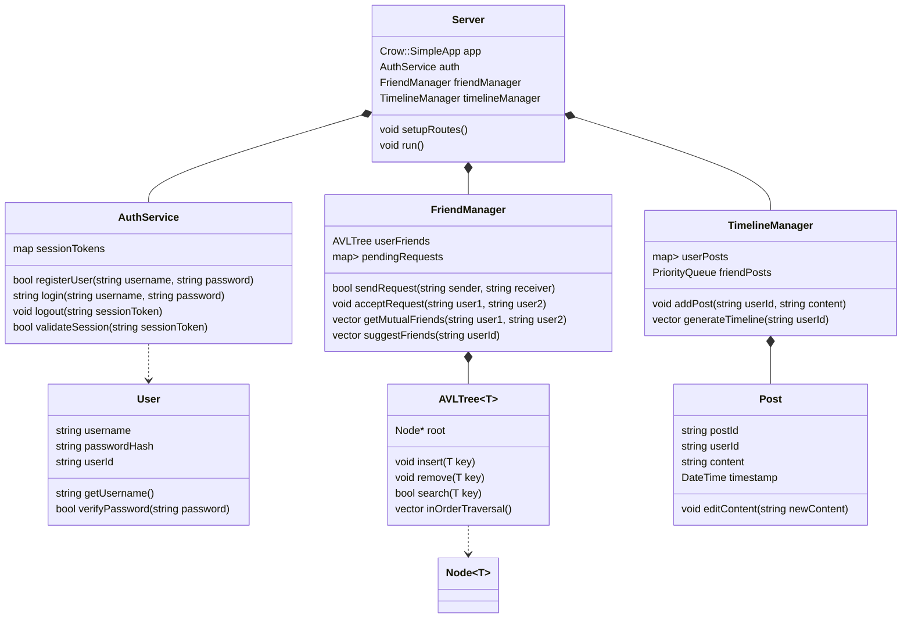

# My Social Media Project

## UML Class Diagram

```mermaid
classDiagram
    class Server {
        Crow::SimpleApp app
        AuthService auth
        FriendManager friendManager
        TimelineManager timelineManager
        void setupRoutes()
        void run()
    }

    class AuthService {
        map<string, string> sessionTokens
        bool registerUser(string username, string password)
        string login(string username, string password)
        void logout(string sessionToken)
        bool validateSession(string sessionToken)
    }

    class User {
        string username
        string passwordHash
        string userId
        string getUsername()
        bool verifyPassword(string password)
    }

    class FriendManager {
        AVLTree<User*> userFriends
        map<string, vector<string>> pendingRequests
        bool sendRequest(string sender, string receiver)
        void acceptRequest(string user1, string user2)
        vector<User*> getMutualFriends(string user1, string user2)
        vector<User*> suggestFriends(string userId)
    }

    class AVLTree~T~ {
        Node<T>* root
        void insert(T key)
        void remove(T key)
        bool search(T key)
        vector<T> inOrderTraversal()
    }

    class TimelineManager {
        map<string, vector<Post>> userPosts
        PriorityQueue<Post> friendPosts
        void addPost(string userId, string content)
        vector<Post> generateTimeline(string userId)
    }

    class Post {
        string postId
        string userId
        string content
        DateTime timestamp
        void editContent(string newContent)
    }

    Server *-- AuthService
    Server *-- FriendManager
    Server *-- TimelineManager
    AuthService ..> User
    FriendManager *-- AVLTree~User*~
    TimelineManager *-- Post
    AVLTree~T~ ..> Node~T~
```
